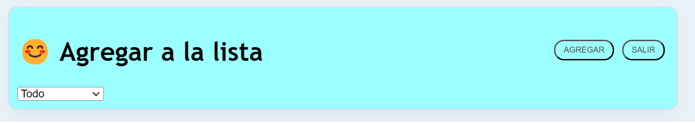
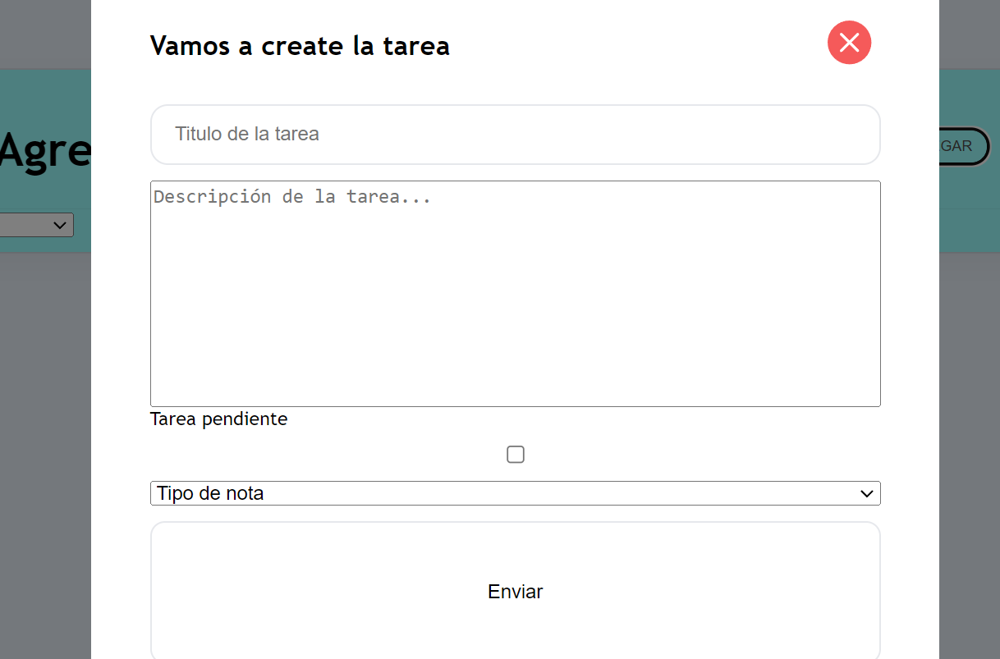
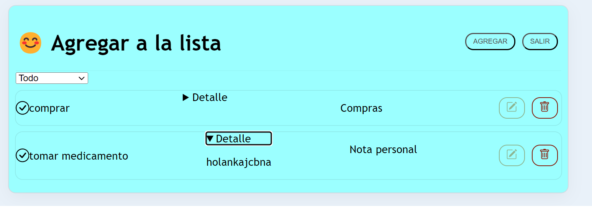

# 📝 TodoApp

## Descripción
Bienvenido a **TodoApp**, la aplicación que te permite tomar notas y organizarlas. Puedes utilizarla para crear notas sobre compras, gestionar turnos médicos o simplemente tomar notas personales. Con **TodoApp**, puedes ver, editar, eliminar y buscar notas por categoría.







## Requisitos Previos
Antes de comenzar, asegúrate de tener instalado lo siguiente:
- [Node.js](https://nodejs.org/): Para ejecutar la aplicación.
- Navegador web moderno.

## Instalación
Sigue estos pasos para instalar y ejecutar **TodoApp**:

1. Clona el repositorio:
   ```bash
   git clone git@github.com:ensolvers-github-challenges/Rojas-c832a4.git
2. Navega al directorio del proyecto:
cd todo

3. Instala las dependencias generales:
npm install
4. Navega hacia la carpeta Client:
cd Client
- Instala las dependencias: 
npm install
5. Instala las dependencias del backend:
Navega hacia la carpeta Server:
cd Server
-Instala las dependencias:
npm install
6. Levanta ambos servidores (frontend y backend):

- Dentro de la carpeta Client:
npm start
- Dentro de la carpeta Server:
npm start

¡Listo! Ahora puedes utilizar TodoApp para tomar notas y organizar tus tareas.

Características
Creación, edición y eliminación de notas.
Búsqueda de notas por categoría.
👉 para el frontend se utilizó React y css
👉 para el backend express
👉 para la base de datos postgreSql


Contacto
Si tienes preguntas o comentarios, no dudes en ponerte en contacto con nosotros en [nadaro@outlook.com].# Todo-App
