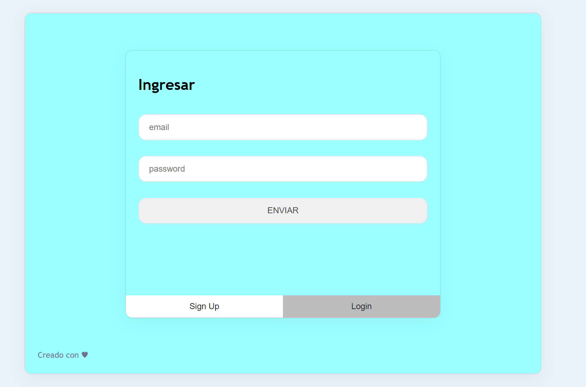
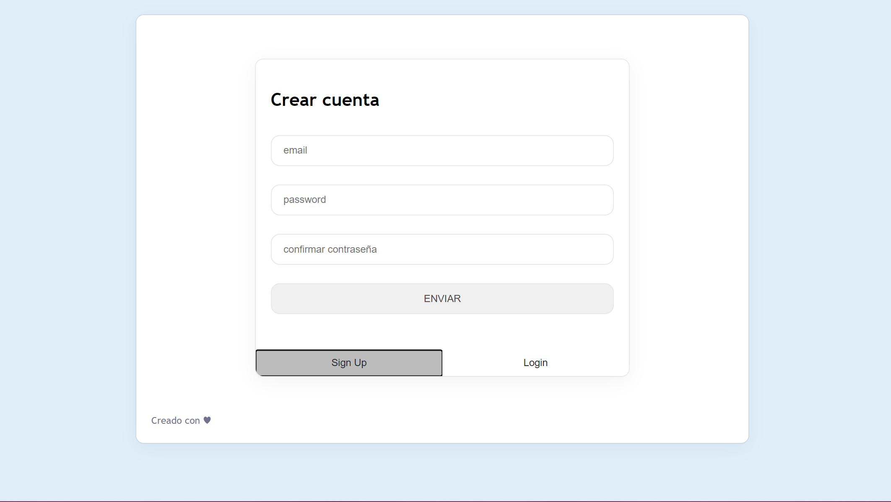
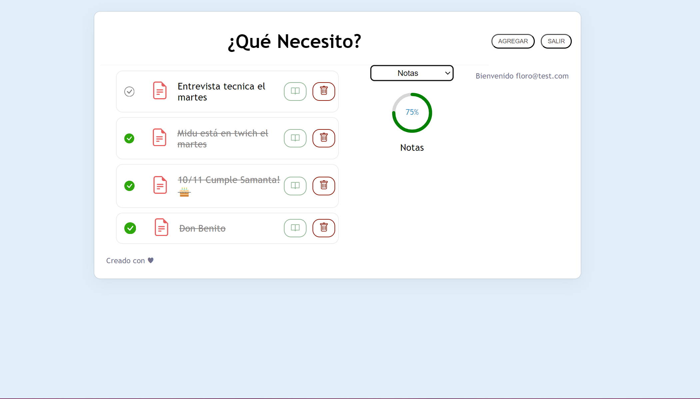

# 📝 TodoApp

## Descripción
Bienvenido a **TodoApp**, la aplicación que te permite tomar notas y organizarlas. Puedes utilizarla para crear notas sobre compras, gestionar turnos médicos o simplemente tomar notas personales. Con **TodoApp**, puedes ver, editar, eliminar y buscar notas por categoría.

<hr/>
En Signup tenés la posibilidad de crear una cuenta, puede ser ficticia, lo importantes es que la recuerdes
ya que se almacenará en la base de datos y guardará tus notas personales, pudiendo administrar varios usuarios.



Para loguearte en la app se utiliza un formulario con email y contraseña, si no estas registrado te red
ireccionara al signup para que puedas crear una cuenta.

<hr/>


<hr/>
Una vez creada tu cuenta podrás acceder a la app y verás el listado de tareas pendientes:
Aquí podrás agregar o eliminar tareas, actualizarlas (si las quieres) y marcar como
completadas.
Podrás agregar tareas y asignarle una categoria. lugo podrás filtrar por la cartegoria deseada.



<hr/>
También podras borrar los registros, o marcar como completadas.


<hr/>


## Requisitos Previos
Antes de comenzar, asegúrate de tener instalado lo siguiente:
- [Node.js](https://nodejs.org/): Para ejecutar la aplicación.
- Navegador web moderno.

## Instalación
Sigue estos pasos para instalar y ejecutar **TodoApp**:

1. Clona el repositorio:
   ```bash
   git clone git@github.com:ensolvers-github-challenges/Rojas-c832a4.git
2. Navega al directorio del proyecto:
   ```bash
   cd todo
3. Instala las dependencias generales:
   ```bash
   npm install
4. Navega hacia la carpeta Client:
   ```bash
   cd Client
- Instala las dependencias: 
   ```bash
   npm install
5. Instala las dependencias del backend:
   
   Navega hacia la carpeta Server:
   ```bash
   cd Server
- Instala las dependencias: 
   ```bash 
   npm install
6. Levanta ambos servidores (frontend y backend):
- Dentro de la carpeta Client:
   ```bash
   npm start

- Dentro de la carpeta Server:

   ```bash
   npm start

¡Listo! Ahora puedes utilizar TodoApp para tomar notas y organizar tus tareas.

Características
Creación, edición y eliminación de notas.
Búsqueda de notas por categoría. 
- 👉 para el frontend se utilizó React y css
- 👉 para el backend express
- 👉 para la base de datos postgreSql


Contacto
Si tienes preguntas o comentarios, no dudes en ponerte en contacto con nosotros en [nadaro@outlook.com].# Todo-App
